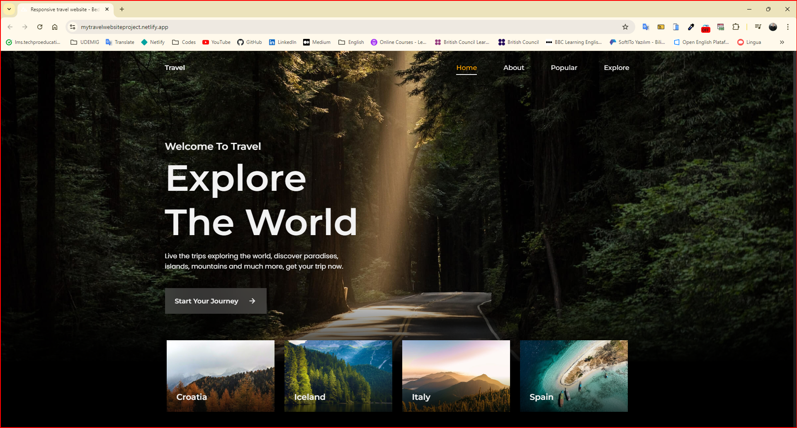
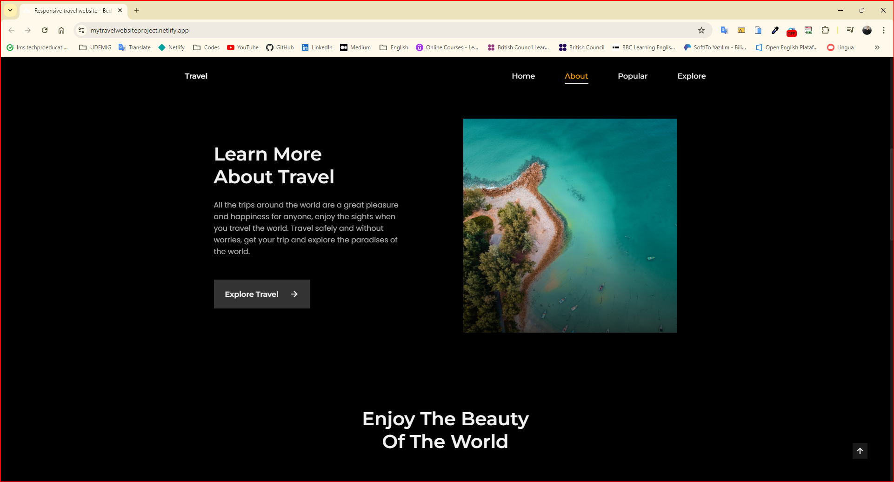
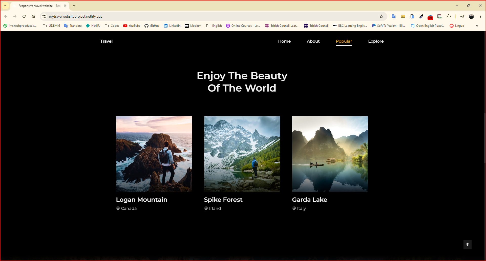
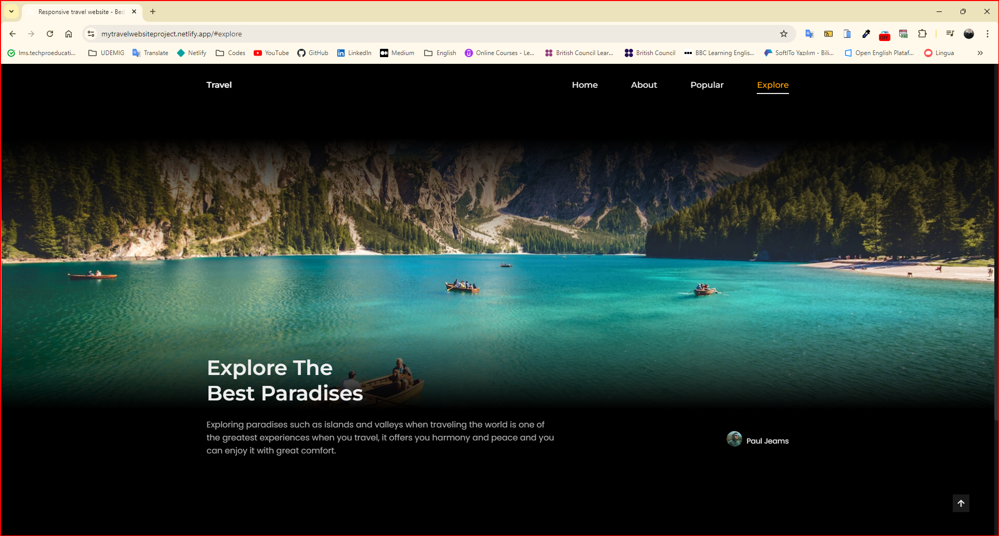

<h1>Travel Website</h1>

I am here with a responsive travel discovery site designed with the power of HTML, CSS, and JavaScript, animated with scrollReveal. A visually impressive travel site with smooth transitions thanks to the ScrollReveal library. It works responsively according to different screen sizes. It guides you to discover unique beauties around the world.

<h2> The following technologies were used in the frontend development phase of my site: </h2>

- HTML5
- CSS3
- Javascript
- ScrollReveal
- RemixIcons

<h2> Visit My Travel Website: </h2>

- https://mytravelwebsiteproject.netlify.app/

<h4>GIF</h4>

<h4>IMAGE</h4>

